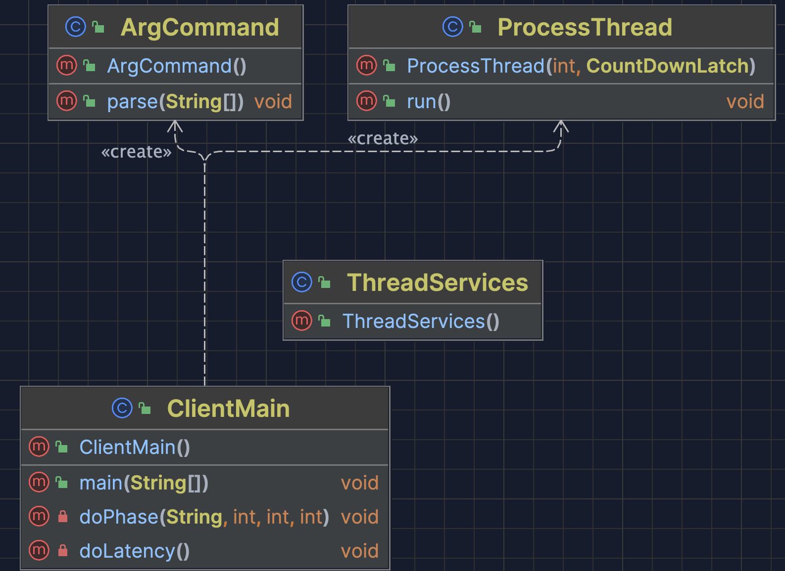

# CS6650 Homework 1 Report

> Author: Xunyan Zhang
> 
> Date: Feb 16, 2024

## Overall Information

Repo URL: https://github.com/zhxunynn/CS6650Assignments/tree/main/Assignment1

Late Day: A week (request was approved by Professor)

## Server

Based on [SkiDataAPI in Swagger](https://app.swaggerhub.com/apis/cloud-perf/SkiDataAPI/2.0#/info), I implemetned the SkierServlet, which can handle the following RESTful API:

By deploying it to the AWS EC2:

We can send request by either Postman, or `curl`, or our client to the 

`API_BASE = http://server:8080/HW1Server`.

## Clients

### Client1

#### Design & Archtecture

In Client1, I introduced helper class `ArgCommand` and `ThreadSerivces`. The `ArgCommand` defines all the arguments that Client can accept, for example, `numOfRequests` is 200k by default, but we can modulate this to achieve quick test.

`ThreadServices` is served as a singleton static class, which contains the thread-safe counting data structures.

With the arguments: `-nt 32 -nr 200000 --host ec2-35-86-254-97.us-west-2.compute.amazonaws.com:8080`, the multithreaded program ran super quickly. The throughput is $2900.61057852678$.

#### Little's Law

First of all, I did a latency test against `us-west-2 (Oregon)` , the result is:

Where the arguments are `-nr 2000 --latency --host ec2-35-86-254-97.us-west-2.compute.amazonaws.com:8080/HW1Server`. 

In my program, I have 32 + 32*3 = 128 threads, and based on 

$L = \lambda W$, we can get:

$\lambda = \frac{L}{W} = 128/0.079604 = 1607.95939903$

Based on the output above, we can notice the requests per thread $(32*1000 + 96 * 1750) / 128 = 1562.5$

Which is super close to $1607$, thus Little's Law holds.

### Client2

#### Design & Archtecture

In addition to Client1, I introduced csv utilities into `ThreadServices`, which holds an `ArrayList` of `Records`, and can also print out the statistics into console & csv file.

#### Statistics

As we can see, the 2972/2900 - 1 = 2% < 5%. The requested information like mean, median, throughput, 99th response time can be found in the picture and below:

| id  | iterm            | value             |
| --- | ---------------- | ----------------- |
| 1   | mean             | 26.992565         |
| 2   | median           | 37.04723874889252 |
| 3   | total throughput | 2972.607422600734 |
| 4   | 99th             | 46.0              |
| 5   | min              | 9.0               |
| 6   | max              | 3034.0            |

### Chart

I utilized `pandas` and `matplotlib` in python to get this figure:

The code can be found at Assignment1/Chart.py

### Bonus

By applying Spring, I get the following results:

The total throughput (**4557.27**) is faster than the previous one (**2900**), which is **157%** as servlet one.

The Spring code can be found in Bonus folder.

