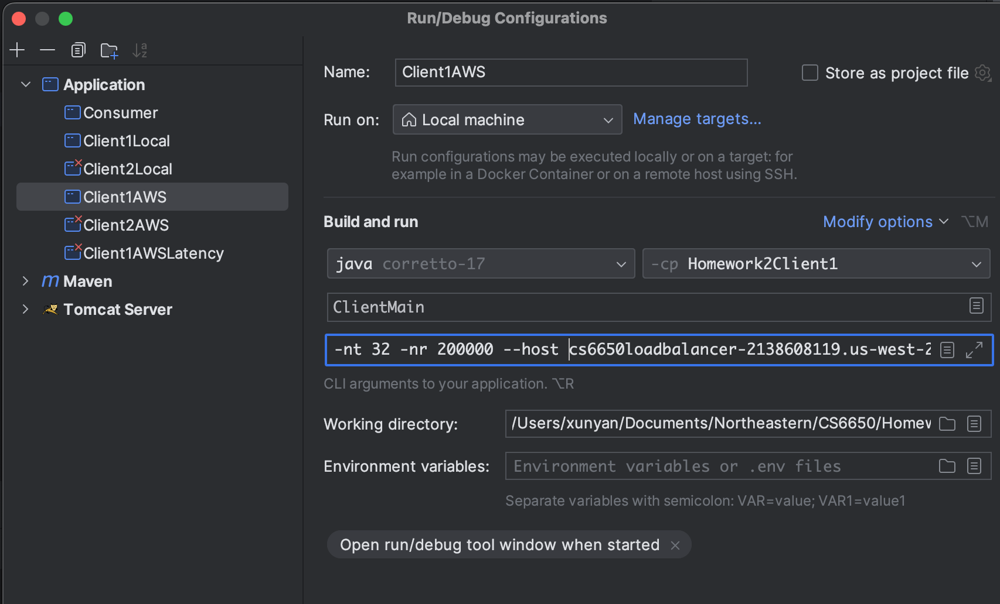

# CS6650 Assignment2 Report

Student: Xunyan Zhang

Git Repo: https://github.com/zhxunynn/CS6650Assignments/tree/main/Assignment2


## Design

### Server


The server structure remains basically identical to the previous assignment, but I introduced configuration based method to this assignment. Server now can read configuration file and load it to start, which benefits a lot when we frequently restarting instances. An example configuration file is 


After loading configuration file from disk, the server will use `ConnectionFactory` to establish a connection to RabbitMQ, and then ready to serve!

The server will firstly check if there is any wrong with the request, which is identical to last assignment. Then we parse it as LiftRide object, so that we can get the useful content like skierID, time, liftID, etc from the object and squeeze them into the message object. 

Then we take a channel from the channel pool, and publish the message to the queue we created in RabbitMQ, return the 201 to clients.

```java
        LiftRide liftRide = gson.fromJson(body, LiftRide.class);
        int skierID = Integer.parseInt(parts[7]);
        JsonObject msg = new JsonObject();
        msg.add("skierID", new JsonPrimitive(skierID));
        msg.add("time", new JsonPrimitive(liftRide.getTime()));
        msg.add("liftID", new JsonPrimitive(liftRide.getLiftID()));
        Channel channel = null;
        try {
            channel = channelPool.take();
            channel.basicPublish("", rabbitMQName, null, msg.toString().getBytes());
            response.setStatus(HttpServletResponse.SC_CREATED);
            response.getWriter().write("{\"Message\": \"The URL is valid, message sent to Rabbit MQ successfully!\"}");
        } catch (InterruptedException e) {
            response.setStatus(HttpServletResponse.SC_EXPECTATION_FAILED);
            throw new ServletException("Failed to initialize RabbitMQ connection", e);
        } finally {
            if (channel != null)
                channelPool.add(channel);
        }
```

### Consumer


After reading the reference docs in Addendum of Assignment2 Guidance, I decided to use `BlockingQueue` as the channel pool. I created the channel pool that shares 20~100 (based on configuration) pre-created channels. Then used an executorPool to start multiple threads, pulling messages from RabbitMQ and acknowledge them.


## Client

Since there is no requirement on changing the Client source code, I directly copied the one from last assignment, with the following parameters:
`-nt 32 -nr 200000 --host cs6650loadbalancer-2138608119.us-west-2.elb.amazonaws.com:8080/Server`.


## Exploration


> - How many client threads are optimal after phase 1 to maximize throughput?
> - How many queue consumers threads do I need to keep the queue size as close to zero as possible? Less than a 1000 max is a great target, but the main aim is to ensure the queue length doesn't continually grow, then shrink, giving a 'pointy' queue length profile, ie /\\. An increase to a plateau is fine, ie /¯¯¯¯\\\. If the plateau is less than a 1000, you are in great shape!

I understand these questions are not necessary to be answered, but I'm curious about them. So I made several different parameters, the left one is recoreded when the consumer threads=10, the middle one is 20, the tall one is 50, and the one after the first top is 30, the toppest one is 24, and the right one is 20 again. So we can conclude from this that, the num of consumer threads doesn't have the linear relationship with queued messages.


## Single Instance Result Analysis

First of all, the AWS instances when executing the single instance analysis are as below:


The parameters is:


And the result is: 


From the above chart, we can notice that the maximum queued message is around 115, which is super good compared to the recommended good value - 1000 in assignement guidance. 

The throughput is 2920, which is sort of similar to the assignment 1 (<=3000).


## Load Balanced Results Analysis

I followed the [tutorial](https://docs.aws.amazon.com/elasticloadbalancing/latest/application/application-load-balancer-getting-started.html#configure-target-group) to set up an auto scalling group with 4 instances load balanced, the steps are attched as below:


Then I used the following parameters to start the test on load balanced server.




As we can see, the result looks better than previous. The maximum queued message was only ~16, and the throughput is 3006, better than the last one without load balancing.


## Bonus

After deep diving into the client & server, I found out the server is busy with both receving messages from clients, and sending messages to message queue, while the most important thing is to respond to users as quick as possible. Based on this, I increased the client's threads, and uses same amount of threads in server to send messages to RabbitMQ, and then get the following amazing results, although the queued messages increased but it's still under limit.


