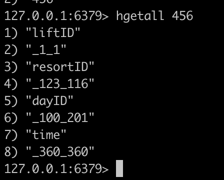

# CS6650 Assignment2 Report

Student: Xunyan Zhang

Git Repo: https://github.com/zhxunynn/CS6650Assignments/tree/main/Assignment3

## Database Design

In order to satisfy the requests, I used skierID as primary key, so that we can easily retrieve the details for skier N. 

The value for each key consists of: `dayID="_".join(days)`, `liftID="_".join(lift)` and `resortID="_".join(resorts)`.

I also used "day{$dayID$}" as another primary key, and the value consists of resortID and skierID.

Here's a screenshot of the database structure:



Based on the above design, we can respond to the requests by:

* "For skier N, how many days have they skied this season?"
  * `redis-cli --raw hgetall skierID | awk 'NR == DAY_LINE_ID' | awk -F "_" '{for(i=2;i<=NF;i+=2) print $i}' | sort -u | wc -l`
* "For skier N, what are the vertical totals for each ski day?" (calculate vertical as liftID*10)
  * `redis-cli --raw hgetall skierID | awk 'NR == LIFTID_LINE_ID' | awk -F "_" '{for(i=2;i<=NF;i+=2) print $i*10}' | paste -sd+ - | bc`
* "For skier N, show me the lifts they rode on each ski day"
  * `redis-cli --raw hget skierID dayID`
* "How many unique skiers visited resort X on day N?"
  * `redis-cli --raw hget "dayN" | awk '{print $1}' | grep '^X_' | cut -d'_' -f2 | sort -u | wc -l` 
  * If we stick to use skierID as key, we have to do the query like:
    
    ```lua
    redis-cli --raw keys skierID | awk '{print $1}' | while read -r skier_id; do \
    skier_value=$(redis-cli hget "$skier_id" "liftID") && \
    resort_id=$(echo "$skier_value" | cut -d'|' -f1) && \
    day_id=$(echo "$skier_value" | cut -d'|' -f3) && \
    if [ "$resort_id" = "X" ] && [ "$day_id" = "N" ]; then \
      echo "$skier_id"; \
    fi; \
    done | wc -l
    ```

## Results Analysis

### Without Improvement

Before we take any changes, the result below is **based on the `t2.micro` instance type:**


As we can notice, the queued messages remain a very high amount. In order to handle this, I tried to increase the capacity of instance but unfortunatelly I don't have money, so throttling is the only option for me.


### With Improvement

In summary, I took the following actions:

* Introduced Exponential Backoffs in Client:
  

* Adopting Resilience4j CircuitBreaker in Server
  
  ```xml
          <dependency>
              <groupId>io.github.resilience4j</groupId>
              <artifactId>resilience4j-circuitbreaker</artifactId>
              <version>2.2.0</version>
          </dependency>
  ```

And the result became:


As we can see, the chart has dramatically improved. Previously we have ~40k queued messages, but after introducing expotential backoffs & the throttling, we can notice the queued message decreased to ~10k, which is 25% of previous queued messages, and the throughput even increased to ~3000.